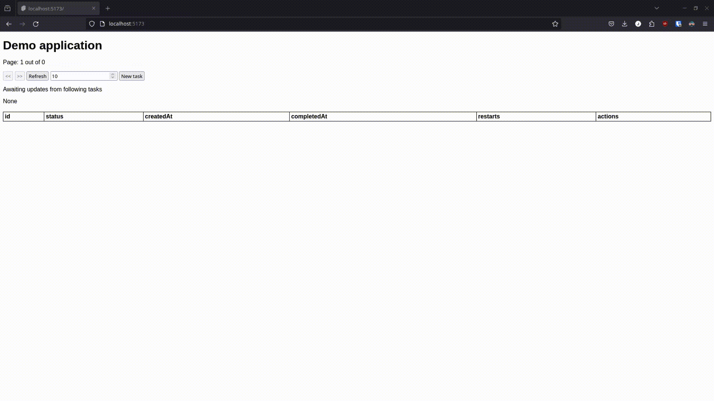

# Task app

Simple application to demonstrate a potential solution to handling long running tasks in a user friendly way.

For example UI creates a task that needs to be ran, say large csv, or file that needs to be checked for malicious content.
Server will process the request. If the request takes longer than a few seconds to process this gives a poor user experience.

Rather we want to start processing the request, informing user that the process has started, and informing them when the state of the process changes.

This way the user immediately can move on to do other things, and check on the status later or keep track of the status if they want to.

## Demonstration

In the video 3 tasks are created, each gets processed one by one until completion.
If the task would fail, it would restart after some delay.

## Areas of improvement

The current implementation does not update the pagination view for statuses, only if the task status is explicitly listened to.

UI is extremely basic and is mainly meant for 16:9 1080p to 1440p resolutions.

The backend sends redundant data sometimes, if the status has not changed or is completed the backend could stop resending messages. 
Although this would require more changes on the frontend to accomodate.

If the frontend loses socket connection, it has no automatic mechanism for reconnection and the page needs to be manually refreshed.
